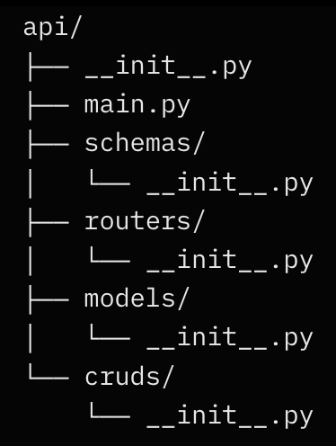

# FastAPI_PY_PRA
  > **'파이썬 FastAPI 개발 입문'** 책을 통해 공부하고, 필요한 내용들을 정리한 레포


# 개념정립
### 컨테이너란?
- 앱에 필요한 요소들을 패키징해서 어디서나 실행 가능하도록 만든 실행단위.
- 파일, 환경 등 모두 포괄

### Docker란?
- 여러 컨테이너를 한번에 다룰 수 있게 해주는 도구
- 환경 차이를 없애거나, 환경을 제한하기 위해 사용
> Rauncher Desktop: 아파치 오픈소스로 쿠버네티스 로컬에서 사용할 수 있게 해주는 GUI 
* 설치 관련 내용은, 인터넷에 많으니 따로 정리 X

### docker 버전 확인
```Bash
docker compose version
```

### Fastapi 기본적인 구조


| 폴더/파일       | 역할 설명                                                                 | 주요 내용                              |
|-----------------|---------------------------------------------------------------------------|----------------------------------------|
| **main.py**     | 앱의 엔트리포인트 (entry point)                                            | FastAPI 앱 생성<br>모든 라우터 연결<br>미들웨어 및 이벤트 설정 |
| **routers/**    | 엔드포인트(URL + HTTP 메서드)를 기능별로 분리                               | 각 도메인별 파일 (예: `user.py`, `item.py`)<br>`APIRouter` 사용 |
| **schemas/**    | API 요청/응답 데이터 형태 정의 (Pydantic 모델)                               | `Create`, `Read`, `Update` 스키마 분리<br>데이터 검증 및 직렬화 |
| **models/**     | 데이터베이스 테이블 구조 정의 (SQLAlchemy ORM)                              | 테이블 클래스 정의<br>컬럼, 관계(ForeignKey, relationship) 설정 |
| **cruds/**      | 실제 DB 작업 로직 (Create, Read, Update, Delete)                           | DB 세션 받아서 모델 조작<br>routers에서 호출하여 사용 |